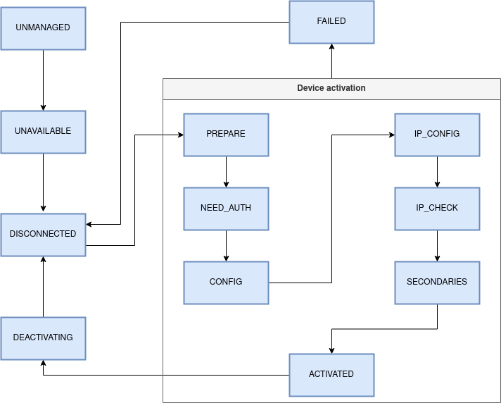

Devices
=======

What is a device
----------------

In NetworkManager, a device represents an object that allows some sort
of network configuration; it can be a regular Linux network interface
(physical as Ethernet or Wi-Fi; or virtual as a bridge or a VLAN), but
it can also be an entity that does not have a link object in the
kernel; examples of the latter kind are modems and OVS bridges/ports.

NetworkManager automatically creates device objects at runtime based
on the device found on the system. It also creates special devices,
called *unrealized* devices that represent potential devices,
e.g. that don't exist yet but will exist when a given connection gets
activated. See the section "Unrealized devices" for more details.

Each device has several properties; the most important are:

 - `iface`: the name of the interface.

 - `ifindex`: for devices backed by a kernel link, this is the kernel
   interface index.

 - `ip_ifindex`: some devices have multiple kernel link associated. In
   such case, `ifindex` is the index of the base link, while
   `ip_ifindex` is the index of the link on which IP configuration
   should be made. For example when activating a PPPoE connection, the
   device has `ifindex` referring to the Ethernet link and
   `ip_ifindex` to the PPP one.

 - `state`: the current state of the device in the device state
   machine, see the next sections.

 - `l3cfg`: the L3Cfg instance takes care of configuring IP on one
   ifindex.

The device object also is exposed on D-Bus, with properties, methods
and signals, see the `interface_info_device` structure.

Activation
----------

To configure a device, NetworkManager needs to activate a connection
profile on it. This happens for two reasons:
 - it was requested by the user via the `ActivateConnection()` and
   `AddAndActivateConnection()` API methods, which are handled by
   functions `impl_manager_activate_connection()` and
   `impl_manager_add_and_activate_connection()`;
 - it is the result of an internal decision; in this case the
   activation is handled by `nm_manager_activate_connection()`; the
   reason can be:
    - the connection profile is activated automatically (for example,
      at startup) because it is configured to auto-connect;
    - the connection profile is being activated as a dependency of
      another profile; for example:
      - a port profile (e.g. bridge port) always depends on the
        corresponding controller profile (e.g. bridge);
      - a controller profile can be configured to automatically
        activate port profiles;
      - during a checkpoint rollback;
      - etc.

The activation starts by first creating a `NMActiveConnection`
object. This is a abstract type used to track the state of the
activation on a specific device; it has two implementations:
`NMActRequest` for regular devices and `NMVpnConnection` for VPNs.

Two important fields of an active connection object are:

 - the *settings-connection*: this is a pointer to the connection
   being activated; it points to the connection in `NMSettings` and
   always reflects the latest changes in the profile;

 - the *applied-connection*: similar to the *settings-connection*, but
   this is a copy of the original *settings-connection* done at the
   time the activation started. During the current activation, the
   properties to configure are always read from this applied
   connection because they shouldn't change even if the profile is
   modified.

Unrealized devices
------------------

We said that to start an activation we need a profile and a
device. What happens if the device doesn't already exist because it is
a virtual one (such as a bridge or a vlan)?

This problem is currently solved in NetworkManager by having a special
kind of devices, *unrealized* devices. Those are 'potential' devices,
that don't exist in kernel; they are created to represent the device
for each virtual profile. Technically speaking, a device is unrealized
when the `real` flag is set to zero in the device private struct.

When NetworkManager decides to activate a virtual profile, the
corresponding device gets realized by calling
`nm_device_create_and_realize()` and then the activation proceeds as
for physical devices.

Object hierarchy
----------------

In the NetworkManager code a device is a `NMDevice` object, which has
several subclasses; each subclass represents a specific kind of device
(`NMDeviceEthernet`, `NMDeviceWifi`, `NMDeviceBridge`, etc.), and can
reimplement properties and methods of the superclass to customize the
behavior (see `struct _NMDeviceClass`).

To show how this is used in practice, let's look at function
`nm_device_is_available()`, which indicates whether a device is ready
to be activated. The function calls the virtual method `is_available()`:

```C
gboolean
nm_device_is_available(NMDevice *self, NMDeviceCheckDevAvailableFlags flags)
{
    ...
    return NM_DEVICE_GET_CLASS(self)->is_available(self, flags);
}
```

`NMDevice` has a generic implementation of that method which performs
generic checks:

```C
static gboolean
is_available(NMDevice *self, NMDeviceCheckDevAvailableFlags flags)
{
    NMDevicePrivate *priv = NM_DEVICE_GET_PRIVATE(self);

    if (priv->carrier || priv->ignore_carrier)
        return TRUE;
    ...

    return FALSE;
}
```

A Ethernet device needs additional checks and so it reimplements the
method to check that the MAC address is already set:

```C
static gboolean
is_available(NMDevice *device, NMDeviceCheckDevAvailableFlags flags)
{
    if (!NM_DEVICE_CLASS(nm_device_ethernet_parent_class)
         ->is_available(device, flags))
        return FALSE;

    return !!nm_device_get_initial_hw_address(device);
}
```

Note how the function first chains up by calling the `NMDevice`
implementation and then it performs an additional check. This pattern
is heavily used in NetworkManager.

Device states
-------------

Each device behaves according to a state machine that looks like this:



While the implementation of the state machine is done in different
functions in `nm-device.c`, the core part is in `_set_state_full()`.

The states are:

 * UNMANAGED: this is the initial state and means that the device is
   not managed by NetworkManager. The unmanaged state is tracked via a
   bitmap of flags, and the device stays in this state while at least
   one flag is set. See the section "Unmanaged flags" below for more
   details. Once all unmanaged flags are cleared, the device is ready
   to become UNAVAILABLE. The state transition is done in function
   `_set_unmanaged_flags()`, which changes the states to UNMANAGED or
   UNAVAILABLE depending on the value of the flags. Note that even if
   it's not displayed in the diagram, the UNMANAGED state can be
   reached by virtually every other state when a unmanaged flag
   becomes set.

 * UNAVAILABLE: the device is managed by NetworkManager, but is not
   available for use.  Reasons may include the wireless switched off,
   missing firmware, no ethernet carrier, missing supplicant or modem
   manager, etc. When a device becomes available, it can transition to
   DISCONNECTED; this decision is taken in various places by
   scheduling a check via `nm_device_queue_recheck_available()`.

 * DISCONNECTED: the device can be activated, but is currently
   idle and not connected to a network. When entering this state from
   a state that belongs to the activation sequence or from
   FAILED/DEACTIVATING, a cleanup of previous configuration is
   done. If there is an activation queued, it's started; otherwise,
   `NMPolicy` reacts to the state change and calls
   `nm_policy_device_recheck_auto_activate_schedule()` to check if
   there a connection that can be auto-activated on the device.

 * PREPARE: this is the first state of an activation; in this
   state some initial operation are performed, such as changing the
   MAC address, setting physical link properties, and anything else
   required to connect to the requested network.

   This state is entered via
   `nm_device_activate_schedule_stage1_device_prepare()`. When
   finished, `nm_device_activate_schedule_stage2_device_config()` is
   used to transition to the CONFIG state. Those functions are
   re-entrant, in the sense that when a device is in a given state and
   needs that an operation completes (or a condition becomes true), it
   can wait and then invoke the same function again; in that way it
   re-enters the same state, where all the conditions are evaluated
   again and if possible the device will transition to the next state.

 * CONFIG: the device is connecting to the requested network.
   This may include operations like associating with the Wi-Fi AP,
   dialing the modem, connecting to the remote Bluetooth device, etc.

 * NEED_AUTH: the device requires more information to continue
   connecting to the requested network.  This includes secrets like
   WiFi passphrases, login passwords, PIN codes, etc.

 * IP_CONFIG: this state is entered via
  `nm_device_activate_schedule_stage3_ip_config()`, and is where IP
  addresses and routes are assigned to the device. Function
  `_dev_ip_state_check()` checks that the configuration is terminated
  according the connection configuration; if so, it moves the device
  to state IP_CHECK.

 * IP_CHECK: in this state, NetworkManager waits that the gateway
   can be pinged successfully if the property
   `connection.gateway-ping-timeout` is set. By default this step is a
   no op since the property is unset. After the optional ping, the
   dispatcher `pre-up` event is emitted, and the device goes to
   SECONDARIES.

 * SECONDARIES: connections have a `connection.secondaries` property
   that specifies a list of UUID of connections of type VPN that can
   be activated automatically when the connection goes up. If there
   are any secondaries, they are activated in this stage; note that
   since this operation involves other devices, it is done in
   `NMPolicy`, upon the emission of the state change signal handled in
   `nm-policy.c:device_state_changed()`. After any secondaries are
   activated, the devices transitions to state ACTIVATED.

 * ACTIVATED: the device has a network connection. Upon entering this
   state the device emits the `up` dispatcher event. The device
   remains is this state until the connection is deactivated or until
   it fails.

 * DEACTIVATING: a disconnection from the current network
   connection was requested, and the device is cleaning up resources
   used for that connection. In this state the `pre-down` dispatcher
   event is emitted. When finished, the devices goes again to
   DISCONNECTED and the `down` dispatch event is fired.

 * FAILED: the device failed to connect to the requested network
   and is cleaning up the connection request. This state can be
   reached from any state belonging to the activation. When the
   cleanup is done, the device goes to DISCONNECTED. If the device was
   previously activated, the `down` dispatcher event is emitted.

Unmanaged devices
-----------------

Each device has a mask of flags representing reasons why the device is
unmanaged; when at least of of those flags is set, the device goes to
state UNMANAGED. When all flags are cleared, the device moves to state
UNAVAILABLE. The unmanaged flags are currently:

  - SLEEPING: the system is suspended, or networking is disabled

  - QUITTING: NetworkManager is shutting down.

  - PLATFORM_INIT: NetworkManager is waiting for udev to announce
    the device. Note that NetworkManager can't touch the device until
    then because udev might perform operations on it (such as renaming
    or changing the MAC). Unrealized devices (see later) have this
    flag set.

  - USER_EXPLICIT: when unmanaged by explicit user decision
      (e.g. via a D-Bus command).

  - USER_SETTINGS: when unmanaged by user decision via the
    settings plugin (for example `keyfile.unmanaged-devices` or
    ifcfg-rh's `NM_CONTROLLED=no`). Although this is
    user-configuration it cannot be overruled and is
    authoritative. That is because users may depend on dropping a
    ifcfg-rh file to ensure the device is unmanaged.

  - USER_CONF: when unmanaged by user decision via the
    NetworkManager.conf ("unmanaged" in the [device]
    section). Contrary to USER_SETTINGS, this can be overwritten via
    D-Bus.

  - BY_DEFAULT: this flag is no longer used.

  - USER_UDEV: unmanaged via a udev rule.

  - EXTERNAL_DOWN: unmanaged because the interface was not created by
    NetworkManager and is currently down.

Note that the unmanaged flags are tracked via two variables
`unmanaged_mask` and `unmanaged_flags`; in this way each flag is in
practice a tri-state variable with possible values TRUE (unmanaged),
FALSE (managed) and UNSET.

External devices and sys-iface-state
------------------------------------

Even if a device is managed, that doesn't mean that NetworkManager is
actively configuring it. When a device is created externally (for
example via `ip link`) and has an IP configuration, NetworkManager
creates a in-memory connection representing the configuration
parameters on the interface such as IP addresses, routes, DNS, etc.;
the connection appears as active but NetworkManager doesn't actually
touch the interface. The external status is tracked in the
`sys-iface-state` member, which can have the following values:

 - EXTERNAL: the interface is not touched by NM.
 - ASSUME: this value is deprecated; it used to mean that NM should manage the device without fully reconfiguring it. Now, the interface is either managed on external.
 - MANAGED: the interface is fully managed.
 - REMOVED: the link was removed externally.
