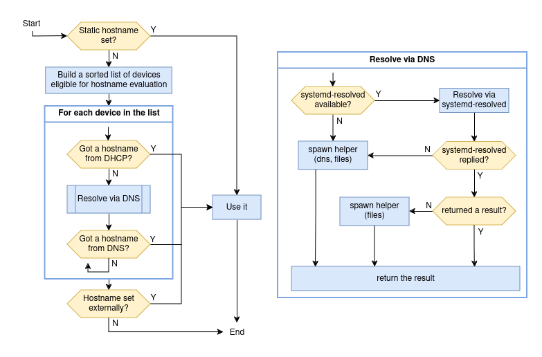

Hostname management
===================

NetworkManager can update the system hostname via different
mechanisms. The following diagram describes the workflow:

A few notes on the diagram:

 - if there is a static hostname set in `/etc/hostname`, no action is
   taken. NetworkManager only manages the transient hostname. See the
   systemd-hostnamed
   [documentation](https://www.freedesktop.org/software/systemd/man/latest/org.freedesktop.hostname1.html#Semantics)
   about the distinction between static and transient hostname.

 - When there is no static hostname set, NetworkManager builds a
   sorted list of active devices that are eligible for the hostname
   evaluation. When doing so, the `hostname` setting of the connection
   active on each device is taken into account. Properties `from-dhcp`
   and `from-dns-lookup` determine if the two methods must be used for
   the device; property `only-from-default` determines whether devices
   without a default route should be considered, and `priority` is
   used to sort the entries. In case of a tie of the priority, a
   device with the default route comes first.

 - When evaluating a given device, first NM checks if the device
   received an hostname via DHCP and then if the first IPv4 and IPv6
   addresses configured on the interface can be resolved to a name via
   DNS. The mechanism used to perform the reverse DNS lookup of a
   specific address is described in the diagram on the right.

 - In the "spawn helper" step, NM starts a separate process that
   performs the reverse DNS lookup using the NSS services specified
   (see `man nsswitch.conf`). Service `dns` does the lookup via a DNS
   query, while `files` returns results from `/etc/hosts`.

 - In case there is no valid result from DHCP or DNS, from any device,
   if there a valid transient hostname set outside of NetworkManager,
   that hostname is honored.
